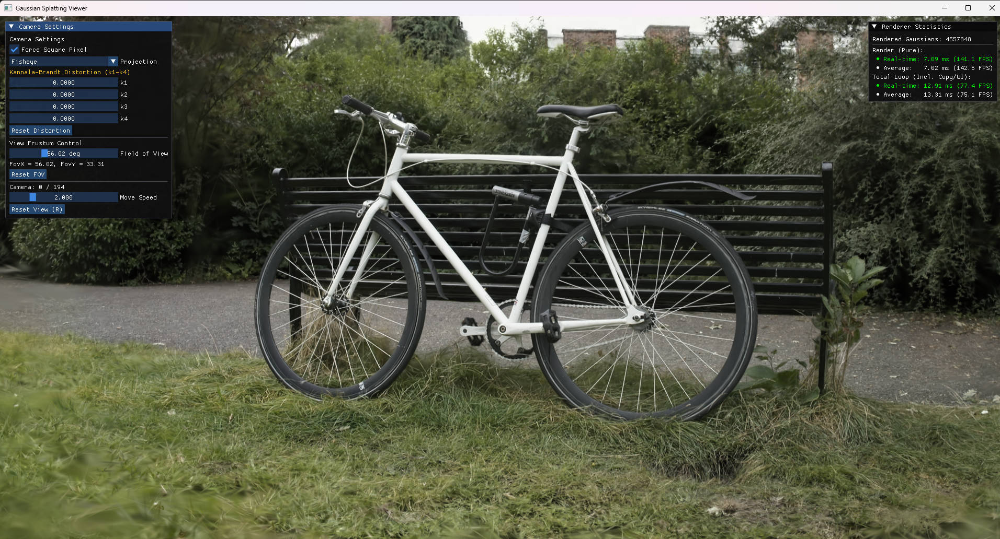

# OptiSplat

**OptiSplat** 是个人学习项目，集成了高效的推理优化trick，实现了一个高性能的 3D Gaussian Splatting 实时渲染器，基于 CUDA 加速，支持交互式查看器。

> 📌 **本项目参考了以下优秀工作**：
> - [FlashGS](https://github.com/FlashGS) - 高效的高斯 - Tile相交检测以及预取流水线
> - [3DGS-TensorCore](https://github.com/3DGS-TensorCore) - 利用 Tensor Core 加速渲染
> - [Fisheye-GS](https://github.com/fisheye-gs) - 鱼眼相机支持（原论文为等距模型，这里扩展为了OpenCV通用鱼眼模型）

## 📖 简介

OptiSplat 实现了优化的 3D Gaussian Splatting 渲染管线，包含以下核心特性：

### ✨ 主要特性

- **🚀 高性能渲染**
  - FlashGS 精确相交检测 — 优化预处理 (preprocess) 阶段
  - FlashGS 预取流水线 — 优化渲染 (renderCUDA) 阶段
  - Tensor Core 加速 — 利用 NVIDIA Tensor Core 加速矩阵运算

- **📷 多相机模型支持**
  - **针孔相机 (Pinhole)** — 标准透视投影
  - **鱼眼相机 (Fisheye)** — 支持 Kannala-Brandt 畸变模型 (k1-k4)
  - **正交相机 (Orthographic)** — 平行投影，无透视效果

- **🖥️ 交互式可视化界面**
  - 基于 ImGui + GLFW 的实时预览
  - 实时性能监控（FPS、渲染耗时、高斯球数量）
  - 相机参数实时调整（投影模式、畸变系数、FOV 等）
  - UE 风格相机控制（WASD 移动 + 鼠标视角）

- **🐍 Python 绑定**
  - 支持通过 Python 调用渲染器

## 🖼️ 可视化界面



*交互式查看器界面，左上角显示相机设置面板，右上角显示实时性能统计*

### 界面功能

| 面板 | 功能 |
|------|------|
| **Camera Settings** | 切换投影模式（Pinhole/Fisheye/Orthographic）、调整畸变系数 k1-k4、修改 FOV |
| **Renderer Statistics** | 实时显示渲染耗时、FPS、Tile高斯相交数量 |

### 交互控制

| 操作 | 功能 |
|------|------|
| `W/A/S/D` | 相机前后左右移动 |
| `Q/E` | 相机上升/下降 |
| 鼠标拖拽 | 调整视角 |
| 滚轮 | 缩放视图 |
| `←/→` 或 `↑/↓` | 切换预设相机视角 |

## 🔧 环境依赖与安装

### 通用要求

- **GPU**: 支持 CUDA 的 NVIDIA 显卡（推荐 RTX 20 系列或更高）
- **CUDA 架构**: 支持 compute capability 7.5 / 8.6 / 8.9
- **CUDA Toolkit**: 11.x 及以上（已正确配置 `nvcc` / 驱动）

### 系统环境依赖
- **Linux / WSL2**
  - `cmake`、`g++`、`cuda-toolkit`
  - OpenGL / X11 相关开发包：

    ```bash
    sudo apt-get update
    sudo apt-get install -y \
        libx11-dev libxcursor-dev libxinerama-dev \
        libxrandr-dev libxi-dev libgl1-mesa-dev \
    ```

- **Windows**
  - Visual Studio 2019 或更高版本（含 C++ 开发工具）
  - CMake 3.20+
  - CUDA Toolkit 11.0+

### 在 C++ 环境中使用
- 方式1：使用vscode的cmake插件，手动编译运行

- 方式2：通过cmake构建运行
  ```bash
  mkdir build
  cd build
  cmake ..
  cmake --build . --config Release
  ```
- 可执行文件：linux: `./optisplat_test`, windows: `optisplat_test.exe`

### 在 Python 环境中使用

- **Python**：3.8+（建议 3.9 / 3.10）
- **依赖安装**（用于 Python 示例 / benchmark）：

  ```bash
  pip install -e .
  pip install matplotlib tqdm numpy
  ```

  其中 `pip install -e .` 会自动构建并安装 `optisplat` Python 包（包含 `optisplat._C` 扩展模块）。


## 🚀 用法

### C++ 示例（查看器 & 简单渲染）

编辑 `src/main.cc` 配置模型和相机路径，然后编译并运行：

```cpp
GsConfig config;
config.modelPath = "path/to/point_cloud.ply";
config.cameraPath = "path/to/cameras.json";
config.bRebuildBinaryCache = false;
config.bUseFlashGSExactIntersection = true;
config.bUseFlashGSPrefetchingPipeline = false;
config.bUseTensorCore = true;

auto renderer = IGaussianRender::CreateRenderer(config);
auto cameras = Utils::readCamerasFromJson(config.cameraPath);

// 运行查看器
runViewer(renderer, cameras, 1920, 1080, -1, false);
```

完整示例见 `src/main.cc`。

### Python 示例（查看器 & 简单渲染）

```python
import optisplat

config = optisplat.GsConfig()
config.modelPath = "path/to/point_cloud.ply"
config.cameraPath = "path/to/cameras.json"
config.bUseFlashGSExactIntersection = True
config.bUseFlashGSPrefetchingPipeline = False
config.bUseTensorCore = True

renderer = optisplat.IGaussianRender.CreateRenderer(config)
cameras = optisplat.readCamerasFromJson(config.cameraPath)

optisplat.runViewer(renderer, cameras, 1920, 1080, -1, debug)
```

完整示例见 `example.py`。


## 📊 性能测试

### 测试脚本：`benchmark.py`

项目内提供了一个用于批量测试不同配置 / 不同分辨率性能的脚本 `benchmark.py`：

```bash
python3 benchmark.py \
  --model /path/to/point_cloud.ply \
  --cameras /path/to/cameras.json \
  --warmup 10
```

- **模型与相机**：
  - `--model`：Gaussian Splatting 点云 `.ply`
  - `--cameras`：相机参数 JSON（如 bicycle 的 `cameras.json`）
- **预热迭代**：
  - `--warmup`：每种配置的预热渲染次数（默认 10），用于避免第一帧偏慢干扰统计
- **调试模式**：
  - `--debug`：可选，传入则以调试模式调用 `render`

### 测试的配置组合

`benchmark.py` 会在同一模型 / 相机上依次测试下面四种配置（与下表中的「Baseline / ExactIntersection / Prefetching / TensorCore」一一对应）：

- **Baseline**
  - `bUseFlashGSExactIntersection = False`
  - `bUseFlashGSPrefetchingPipeline = False`
  - `bUseTensorCore = False`
- **ExactIntersection Only**
  - `bUseFlashGSExactIntersection = True`
  - `bUseFlashGSPrefetchingPipeline = False`
  - `bUseTensorCore = False`
- **ExactIntersection + Prefetching**
  - `bUseFlashGSExactIntersection = True`
  - `bUseFlashGSPrefetchingPipeline = True`
  - `bUseTensorCore = False`
- **ExactIntersection + TensorCore**
  - `bUseFlashGSExactIntersection = True`
  - `bUseFlashGSPrefetchingPipeline = False`
  - `bUseTensorCore = True`

同一配置只会创建一次 `renderer`，在此基础上测试多种分辨率，避免重复加载模型。

### 测试的分辨率组合

每种配置会在以下四组分辨率下进行测试：

- **原始分辨率**：使用相机 JSON 中记录的原始 `width / height`
- **2 倍下采样**：调用 `GsCamera.rescaleResolution(2)`，长宽各缩小 2 倍
- **4 倍下采样**：调用 `GsCamera.rescaleResolution(4)`，长宽各缩小 4 倍
- **1080p**：调用 `GsCamera.setResolution(1920, 1080)` 统一设为 1080p

脚本会对每个相机逐帧渲染，实时在进度条中输出当前帧的 **FPS / Delay(ms)**，并在最后给出各配置在不同分辨率下的平均性能汇总表。

### 📊 实测性能数据（示例）

**测试环境**: WSL2 on Windows 11, CUDA 12.8, GPU RTX5060Ti(16GB)
**测试场景**: [官方模型](https://repo-sam.inria.fr/fungraph/3d-gaussian-splatting/datasets/pretrained/models.zip) bicycle (6,131,954 高斯球)

**分辨率说明**:
- 原始分辨率：4946×3286
- 2 倍降采样：2473×1643
- 4 倍降采样：1236×821
- 1080p: 1920×1080

| 配置 | 原始分辨率<br>(4946×3286) | 2 倍降采样<br>(2473×1643) | 4 倍降采样<br>(1236×821) | 1080p<br>(1920×1080) | 1080p 相对 Baseline 提升 |
|------|-------------------------|-------------------------|-------------------------|---------------------|--------------------------|
| **Baseline** | 12.1 FPS<br>82.62 ms | 34.9 FPS<br>28.58 ms | 75.1 FPS<br>13.31 ms | 51.2 FPS<br>19.50 ms | 1.00× |
| **ExactIntersection Only** | 58.4 FPS<br>17.1 ms | 108.4 FPS<br>9.22 ms | 152.9 FPS<br>6.53 ms | 132.5 FPS<br>7.54 ms | ≈2.59× |
| **ExactIntersection + TensorCore** | 90.0 FPS<br>11.10 ms | **157.6 FPS<br>6.34 ms** | **208.2 FPS<br>4.80 ms** | **183.8 FPS<br>5.43 ms** | ≈3.59× |
| **ExactIntersection + Prefetching** | **93.4 FPS<br>10.69 ms** | 157.0 FPS<br>6.36 ms | 177.6 FPS<br>5.62 ms | 176.5 FPS<br>5.66 ms | ≈3.45× |

**注**: 数据为平均值，实际性能取决于 GPU 型号和场景复杂度。

## 📁 项目结构

下面是项目的主要目录和文件（只列出与使用相关的核心部分）：

```
OptiSplat/
├── CMakeLists.txt            # CMake 构建配置（可执行程序 + Python 扩展）
├── README.md                 # 本文件
├── setup.py                  # Python 安装脚本（pip install -e .）
├── example.py                # Python 示例脚本（基础用法 / Viewer）
├── benchmark.py              # Python 性能测试脚本（多配置 + 多分辨率）
├── demo.ipynb                # Jupyter 演示
├── docs/
│   ├── viewer_screenshot.jpg # 查看器截图
│   └── ...                   # 其他文档 / 资源
├── include/
│   ├── camera.h              # 相机定义（Pinhole / Fisheye / Orthographic）
│   ├── render.h              # 渲染器接口 (IGaussianRender / GsConfig 等)
│   └── utils.h               # 工具函数（读写相机、日志等）
├── src/
│   ├── main.cc               # C++ 主程序入口（optisplat_test）
│   ├── render.cc             # 渲染实现（调用 CUDA Kernel）
│   ├── camera.cc             # 相机实现（投影矩阵 / 分辨率缩放）
│   ├── viewer.cc             # 交互式查看器（ImGui + GLFW）
│   ├── pybind.cc             # Python 绑定（导出 GsConfig / GsCamera / IGaussianRender 等）
│   ├── utils.cc              # 工具实现
│   ├── diff-gaussian-rasterization/  # 核心 Gaussian Splatting CUDA 实现 (FlashGS / TC-GS backend)
│   └── optisplat/            # Python 包目录
│       ├── __init__.py       # 对外暴露 Python API（导入 _C 模块等）
│       └── _C*.so            # 编译生成的 Python 扩展模块（由 CMake / setup.py 生成）
└── third_party/              # 第三方依赖（无需手动修改）
    ├── glfw-3.4/             # 窗口管理
    ├── imgui-1.92.6/         # GUI
    ├── glad/                 # OpenGL 加载
    ├── glm/                  # 数学库
    └── eigen-3.4.0/          # 线性代数
```


## 🙏 致谢

本项目实现参考了以下优秀工作：

- **FlashGS** — 高效的光线追踪高斯球相交算法
- **3DGS-TensorCore** — Tensor Core 在 3DGS 渲染中的应用
- **Fisheye-GS** — 鱼眼相机的 Gaussian Splatting 支持

感谢这些项目的开源贡献！

---

*OptiSplat - Optimized Gaussian Splatting Renderer*
